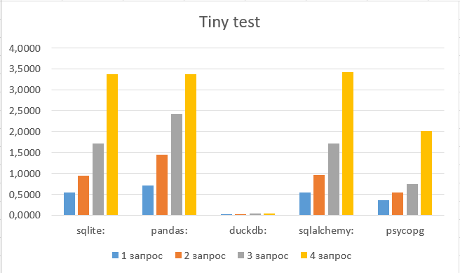
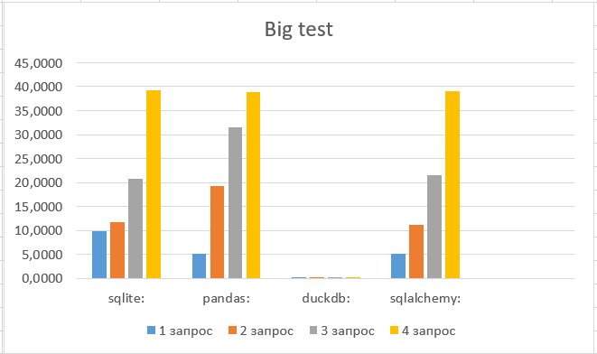

# 4 queries
## Результаты

## Запуск
1. Поправьте configuration.py
2. Запустите mainfile.py
3. Подождите
4. Введите нужную библиотеку
5. Подождите

# Выводы
Самой необычайно быстрой библиотекой для работы с данными является Duckdb. Duckdb понравился мне больше всего не только из-за того, что он опережает другие библиотеки в разы, но также и потому что с ним удобно работать, есть удобные встроенные функции. На втором месте - psycopg2 (субд postgresql). Хоть поработать на большом файле с ним так и не получилось, на tiny файле на 200 мб он показал хорошие результаты и оказался быстрее, чем sqlalchemy, pandas и sqlite. В нем также есть множество различных функций. Эта библиотека весьма пользуется популярностью, так что можно сказать, что она подходит для многих действий. Примерно одинаковыми по времени оказались три другие библиотеки - pandas, sqlalchemy и sqlite. Pandas - наверное, самый комфортный в использовании, потому что именно с помощью его понятных функций удобнее всего было читать .csv файлы и записывать данные в базу. Библиотеки SQLalchemy и SQlite3 тоже порадовали, работать с ними было не сложно. 
По итогу самым оптимальным было бы использование библиотеки duckdb - высокопроизводительного инструмента, который отличается своей быстротой и надежностью. 
